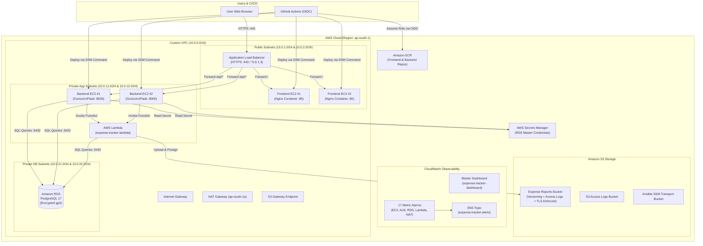
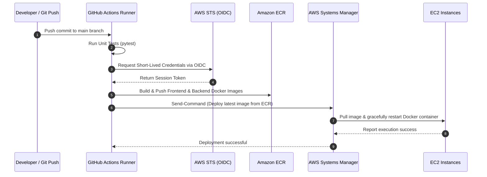

# Cloud Expense Tracker

[](https://aws.amazon.com/)
[](https://www.terraform.io/)
[](https://www.ansible.com/)
[](https://www.docker.com/)
[](https://www.python.org/)
[](https://www.postgresql.org/)
[](LICENSE)

A secure, multi-tier cloud infrastructure and DevOps platform running on AWS. Demonstrates declarative Infrastructure as Code (IaC) via Terraform, zero-SSH configuration management via AWS Systems Manager (SSM), containerized workloads, end-to-end HTTPS routing, serverless reporting, and comprehensive native CloudWatch observability.

---

## Table of Contents

- [Project Overview](#project-overview)
- [Architecture](#architecture)
  - [Architecture Overview](#architecture-overview)
  - [Architecture Diagram](#architecture-diagram)
  - [Core Components Breakdown](#core-components-breakdown)
- [Repository Structure](#repository-structure)
- [Local Development](#local-development)
  - [Prerequisites](#prerequisites)
  - [Running with Docker Compose](#running-with-docker-compose)
  - [API Endpoints](#api-endpoints)
- [Infrastructure (Terraform)](#infrastructure-terraform)
  - [Terraform Structure](#terraform-structure)
  - [Variables Configuration](#variables-configuration)
  - [Deployment Steps](#deployment-steps)
- [Clone and Deploy to Your AWS Account](#clone-and-deploy-to-your-aws-account)
- [CI/CD Deployment Pipeline](#cicd-deployment-pipeline)
  - [OIDC GitHub Actions Architecture](#oidc-github-actions-architecture)
  - [Workflow Sequence](#workflow-sequence)
- [CloudWatch Observability & Monitoring](#cloudwatch-observability--monitoring)
  - [Master Dashboard](#master-dashboard)
  - [Automated Alarms](#automated-alarms)
  - [Cost-Safe Telemetry Design](#cost-safe-telemetry-design)
- [Configuration Management (Ansible)](#configuration-management-ansible)
  - [Dynamic EC2 Inventory via SSM](#dynamic-ec2-inventory-via-ssm)
  - [Docker Provisioning Playbook](#docker-provisioning-playbook)
- [Security Posture](#security-posture)
- [AWS Resources Summary](#aws-resources-summary)
- [Security Policy & Disclosures](#security-policy--disclosures)
- [License](#license)

---

## Project Overview

The **Cloud Expense Tracker** is a production-grade full-stack financial tracking and reporting platform. Users can log daily expenditures by category, calculate real-time aggregates, record descriptions, and trigger serverless summary reports with presigned S3 downloads.

The system is engineered following enterprise DevOps and cloud architecture principles:
- **Declarative Infrastructure**: All AWS cloud resources are provisioned declaratively through Terraform with zero manual console dependencies.
- **Zero-SSH Administration**: Port 22 is completely closed. All server configuration and automated deployments occur through AWS Systems Manager (SSM).
- **Multi-AZ High Availability**: Redundant compute nodes are deployed across two availability zones (`ap-south-1a` and `ap-south-1b`) fronted by an Application Load Balancer.
- **Defense in Depth**: Clear tier isolation across public subnets (ALB & frontend), private application subnets (backend EC2 & Lambda), and private database subnets (RDS PostgreSQL).
- **Comprehensive Observability**: Native AWS CloudWatch dashboard, 17 automated metric alarms, and application log filters without expensive third-party agents.

---

## Architecture

### Architecture Overview

1. **Traffic Ingress & SSL Termination**:
   - Inbound HTTP traffic (port 80) is redirected to HTTPS (port 443) via HTTP 301.
   - The Application Load Balancer enforces TLS 1.2 / TLS 1.3 with AWS Certificate Manager (ACM).
2. **Routing Rules**:
   - `/` and static assets forward to the frontend target group (2 frontend EC2 instances running Nginx containers).
   - `/api/*` forwards to the backend target group (2 backend EC2 instances running Gunicorn/Flask containers on port 8000).
3. **Database Tier**:
   - Backend EC2 instances connect to an isolated, private Amazon RDS PostgreSQL 17 database instance in dedicated DB subnets.
   - Database credentials are automatically created, stored, and rotated via AWS Secrets Manager (`manage_master_user_password = true`).
4. **Serverless Reporting Flow**:
   - Users request reports via `POST /api/reports` routed through the Application Load Balancer to the backend EC2 service.
   - Backend EC2 invokes the VPC-connected AWS Lambda function server-side via `boto3`.
   - The Lambda function aggregates expense data from PostgreSQL RDS, compiles the report, uploads it to a private Amazon S3 bucket, and returns a time-limited presigned S3 URL.
   - *Rollback Path*: Amazon API Gateway HTTP API (`POST /reports`) is preserved as a verified standby rollback route.

### Architecture Diagram



### Core Components Breakdown

| Layer | Technology | Role & Configuration |
| :--- | :--- | :--- |
| **Networking** | AWS VPC | Custom `10.0.0.0/16` CIDR with 6 subnets across 2 AZs (`ap-south-1a`, `ap-south-1b`), IGW, NAT Gateway, and S3 Gateway Endpoint. |
| **Load Balancing** | AWS ALB | Public Application Load Balancer with HTTP-to-HTTPS redirect and path routing (`/` to frontend on port 80; `/api/*` to backend on port 8000). |
| **Frontend Compute** | Amazon EC2 (AL2023) | 2x `t3.micro` instances in public subnets serving the Vanilla JS/Nginx application. |
| **Backend Compute** | Amazon EC2 (AL2023) | 2x `t3.micro` instances in private subnets executing the Flask REST API via Docker/Gunicorn on port 8000. |
| **Database** | Amazon RDS PostgreSQL | Managed PostgreSQL 17 in dedicated private DB subnets with encrypted storage, automated Secrets Manager credentials, and no public route. |
| **Serverless Reporting** | AWS Lambda & S3 | VPC-connected Python 3.12 Lambda function querying PostgreSQL RDS, compiling JSON/PDF reports, and storing them in private versioned S3. |
| **Rollback API** | Amazon API Gateway | HTTP API with route-specific throttling retained as an immediate rollback infrastructure path. |
| **Container Registry**| Amazon ECR | Separate repositories for `expense-tracker-frontend` and `expense-tracker-backend` with scan-on-push enabled. |
| **Management** | AWS SSM & Ansible | Agent-based remote orchestration eliminating SSH key exposure and open inbound management ports. |

---

## Repository Structure

```text
cloud-expense-tracker/
├── .github/
│   └── workflows/
│       └── docker-build-push.yml # GitHub Actions CI/CD deployment pipeline via AWS OIDC & SSM
├── .gitignore                    # Comprehensive ignore rules (Terraform, Python, Ansible, secrets)
├── docker-compose.yml            # Local development orchestration (DB, API, Web)
├── LICENSE                       # MIT Open-Source License
├── README.md                     # Project architecture, setup, and operational documentation
├── SECURITY.md                   # Security vulnerability reporting guidelines and policies
├── ansible/                      # Ansible configuration and automation playbooks
│   ├── ansible.cfg               # Inventory path and default connection behavior
│   ├── inventory/
│   │   └── aws_ec2.yml           # Dynamic AWS EC2 SSM inventory plugin configuration
│   └── playbooks/
│       ├── ping.yml              # Connectivity verification playbook over AWS SSM
│       └── docker.yml            # Docker installation and service enablement playbook
├── backend/                      # Python Flask REST API
│   ├── Dockerfile                # Python 3.12-slim production container (non-root appuser)
│   ├── requirements.txt          # Python dependencies (Flask, Gunicorn, psycopg, boto3, PyJWT)
│   ├── .dockerignore             # Docker build exclusion rules
│   ├── .env.example              # Sample environment variables for local testing
│   ├── app/
│   │   ├── __init__.py           # Application package initializer
│   │   ├── auth.py               # Amazon Cognito JWT verification & optional auth decorator
│   │   ├── config.py             # Dynamic database URL resolution via AWS Secrets Manager
│   │   ├── db.py                 # PostgreSQL connection handling & table initialization
│   │   ├── limiter.py            # Rate limiting configuration via Flask-Limiter
│   │   ├── main.py               # WSGI application factory, CORS, and security headers
│   │   └── routes.py             # API endpoints (/health, /expenses, /reports, /infrastructure)
│   └── tests/                    # Pytest test suite
│       ├── test_auth.py          # Authentication and token verification tests
│       ├── test_hardening.py     # Payload bounds, input validation, and security tests
│       └── test_reports.py       # Lambda invocation and reporting endpoint tests
├── frontend/                     # Nginx static web frontend
│   ├── Dockerfile                # Nginx Alpine container definition
│   ├── docker-entrypoint.sh      # Container entrypoint script initializing host instance info
│   ├── index.html                # Single-page expense tracker application UI
│   ├── style.css                 # Application styles and responsive design
│   ├── app.js                    # Client-side JavaScript (Fetch API integration & XSS escaping)
│   └── instance-info.json        # Instance metadata placeholder for development
└── terraform/                    # Terraform Infrastructure as Code (IaC)
    ├── provider.tf               # AWS provider configuration
    ├── variables.tf              # Input variable definitions (region, project_suffix, etc.)
    ├── terraform.tfvars.example  # Example values template for all configurable variables
    ├── vpc.tf                    # VPC, subnets, route tables, IGW, NAT, S3 gateway endpoint
    ├── alb.tf                    # Application Load Balancer, HTTPS listener, target groups
    ├── ec2.tf                    # Security groups, EC2 instances, SSM instance profiles
    ├── rds.tf                    # RDS PostgreSQL 17 instance with Secrets Manager integration
    ├── s3.tf                     # S3 buckets (reports, access logs, Ansible SSM transport)
    ├── iam.tf                    # IAM roles & policies for SSM, EC2, Lambda, and GitHub OIDC
    ├── ecr.tf                    # ECR repositories with automated image scanning on push
    ├── lambda.tf                 # Lambda reporting function, VPC config, IAM execution role
    ├── lambda_function.py        # Lambda handler script
    ├── api_gateway.tf            # API Gateway HTTP API and Lambda integration (rollback path)
    ├── cloudwatch.tf             # Master Dashboard, 17 Metric Alarms, and Log Metric Filters
    └── outputs.tf                # Exported resource identifiers and connection endpoints
```

---

## Local Development

### Prerequisites

- [Docker](https://docs.docker.com/get-docker/) & [Docker Compose](https://docs.docker.com/compose/)
- [Python 3.12+](https://www.python.org/) (if running tests locally)
- [Git](https://git-scm.com/)

### Running with Docker Compose

1. Clone the repository:
   ```bash
   git clone https://github.com/your-username/cloud-expense-tracker-aws.git
   cd cloud-expense-tracker-aws
   ```

2. Start the local multi-container stack:
   ```bash
   docker compose up --build
   ```

   This launches three coordinated local containers:
   - `expense-postgres`: PostgreSQL 17 database on port `5432`.
   - `expense-backend`: Flask API server on port `8000`.
   - `expense-frontend`: Nginx serving the static single-page app on port `3000`.

3. Access the application:
   - **Frontend UI**: Open [http://localhost:3000](http://localhost:3000)
   - **Health Check**: [http://localhost:8000/api/health](http://localhost:8000/api/health)
   - **Expenses API**: [http://localhost:8000/api/expenses](http://localhost:8000/api/expenses)

4. Run the test suite:
   ```bash
   pytest backend/tests
   ```

5. Stop the containers:
   ```bash
   docker compose down -v
   ```

### API Endpoints

| Method | Endpoint | Description | Rate Limit | Sample Response |
| :--- | :--- | :--- | :--- | :--- |
| `GET` | `/api/health` | Service and database health probe | Exempt | `{"database":"connected","status":"healthy"}` |
| `GET` | `/api/expenses` | Retrieve recorded expenses (up to 100) | 10/sec, 60/min | `[{"id": 1, "amount": 150.0, "category": "Office", ...}]` |
| `POST` | `/api/expenses` | Record a new validated expense | 2/sec, 20/min | `{"id": 2, "amount": 250.0, "category": "Food", ...}` |
| `DELETE` | `/api/expenses/<id>` | Delete an expense by ID | 2/sec, 15/min | `{"message": "Expense deleted successfully"}` |
| `POST` | `/api/reports` | Serverless report generation via Lambda & S3 | 10/sec, 30/min | `{"report_url": "https://...s3.amazonaws.com/...", ...}` |

---

## Infrastructure (Terraform)

### Terraform Structure

The infrastructure is organized cleanly by AWS resource domain:
- `vpc.tf`: Multi-tier network architecture across 2 AZs (`public`, `private-app`, `private-db`).
- `alb.tf`: Public Application Load Balancer with HTTPS redirect, TLS 1.3, and path routing.
- `ec2.tf`: Frontend and backend EC2 instances configured with IAM SSM profiles and restrictive security groups.
- `rds.tf`: Amazon RDS PostgreSQL 17 with automated Secrets Manager credential rotation.
- `iam.tf`: Least-privilege IAM roles for SSM, EC2, Lambda, and GitHub Actions OIDC.
- `s3.tf`: Encrypted, versioned S3 buckets with strict TLS-only bucket policies.
- `lambda.tf`: Serverless report generation function inside the private VPC.
- `api_gateway.tf`: Rollback HTTP API with rate limiting and structured access logs.
- `cloudwatch.tf`: Master Dashboard, 17 metric alarms, and application log filters.
- `ecr.tf`: Container registries with image vulnerability scanning.

### Variables Configuration

1. Create `terraform.tfvars` from the provided template:
   ```bash
   cd terraform
   cp terraform.tfvars.example terraform.tfvars
   ```

2. Configure your environment-specific values in `terraform.tfvars`:
   ```hcl
   region            = "ap-south-1"
   project_suffix    = "yourname2026"
   db_username       = "expense_user"
   github_repository = "your-username/cloud-expense-tracker-aws"
   certificate_arn   = "arn:aws:acm:ap-south-1:123456789012:certificate/example-uuid"
   alert_email       = "ops@example.com"
   ```

---

## Clone and Deploy to Your AWS Account

Follow these steps to deploy this complete architecture in your own AWS account:

### 1. Prerequisites
- An AWS account with administrative permissions.
- [AWS CLI](https://aws.amazon.com/cli/) configured with `aws configure`.
- [Terraform](https://www.terraform.io/) (v1.5+).
- A domain name with an SSL certificate created in **AWS Certificate Manager (ACM)** in your deployment region (e.g. `ap-south-1`).

### 2. Provision Infrastructure
```bash
cd terraform

# Initialize providers
terraform init

# Validate configuration syntax
terraform validate

# Review proposed resources
terraform plan

# Apply infrastructure
terraform apply
```

### 3. Configure GitHub Actions CI/CD
1. In your GitHub repository, navigate to **Settings** > **Secrets and variables** > **Actions** > **Variables**.
2. Add the following repository variables:
   - `AWS_REGION`: Your deployment region (e.g. `ap-south-1`).
   - `AWS_ROLE_TO_ASSUME`: The ARN of the IAM role output by Terraform (`terraform output GITHUB_ACTIONS_ROLE_ARN`).
3. Push to `main` branch to trigger the automated build, test, container push to Amazon ECR, and deployment via AWS Systems Manager (SSM).

---

## CI/CD Deployment Pipeline

### OIDC GitHub Actions Architecture

Deployments run through GitHub Actions using OpenID Connect (OIDC) federation:
- **No Long-Lived AWS Keys**: No static `AWS_ACCESS_KEY_ID` or `AWS_SECRET_ACCESS_KEY` are stored in GitHub secrets.
- **Short-Lived STS Credentials**: GitHub Actions exchanges an OIDC token for short-lived AWS STS credentials.
- **Repository Scoping**: The IAM role trust policy explicitly pins the `sub` claim to `repo:<owner>/<repo>:ref:refs/heads/main`, ensuring forks or untrusted pull requests cannot assume deployment permissions.

### Workflow Sequence



---

## CloudWatch Observability & Monitoring

### Master Dashboard

A unified 9-section master dashboard (`expense-tracker-dashboard`) provides complete operational visibility across the entire architecture on a single pane of glass:

1. **Overall Health & Traffic**: ALB healthy/unhealthy targets, HTTP 2xx/3xx/4xx/5xx counts, response times, request throughput, and consumed LCUs.
2. **Frontend EC2**: CPU utilization, status check failures, and network I/O across `frontend-1` and `frontend-2`.
3. **Backend EC2**: CPU utilization, status check failures, and network I/O across `backend-1` and `backend-2`.
4. **RDS Database**: CPU, database connections, free storage space, freeable memory, swap usage, read/write IOPS, throughput, latency, and queue depth.
5. **Lambda Reporting**: Invocations, execution errors, average and p95 duration, throttles, and concurrent executions.
6. **NAT Gateway**: Outbound/inbound data transfer, active connections, SNAT port allocation errors, packet drops, and idle timeouts.
7. **S3 Storage**: Bucket storage bytes and object counts.
8. **API Gateway (Rollback Path)**: Standby route request count, 4xx/5xx errors, latency, and integration latency.
9. **Application Error Tracking**: CloudWatch Log metric filter tracking serverless report generation errors.

### Automated Alarms

17 metric alarms are linked to `aws_sns_topic.alerts` (`expense-tracker-alerts`):

| Alarm Name | Target | Metric & Threshold |
| :--- | :--- | :--- |
| `ec2-frontend-1-status-check-failed` | EC2 | `StatusCheckFailed >= 1` (300s, 2 periods) |
| `ec2-frontend-2-status-check-failed` | EC2 | `StatusCheckFailed >= 1` (300s, 2 periods) |
| `ec2-backend-1-status-check-failed` | EC2 | `StatusCheckFailed >= 1` (300s, 2 periods) |
| `ec2-backend-2-status-check-failed` | EC2 | `StatusCheckFailed >= 1` (300s, 2 periods) |
| `ec2-backend-1-cpu-high` | EC2 | `CPUUtilization >= 85%` (300s, 2 periods) |
| `alb-backend-unhealthy-hosts` | ALB | `UnHealthyHostCount >= 1` (60s, 2 periods) |
| `alb-target-5xx-errors-elevated` | ALB | `HTTPCode_Target_5XX_Count >= 5` (300s, 1 period) |
| `alb-target-response-time-high` | ALB | `TargetResponseTime >= 2.0s` (300s, 2 periods) |
| `rds-cpu-utilization-high` | RDS | `CPUUtilization >= 80%` (300s, 2 periods) |
| `rds-freeable-memory-low` | RDS | `FreeableMemory <= 64 MB` (300s, 2 periods) |
| `rds-free-storage-low` | RDS | `FreeStorageSpace <= 5 GB` (300s, 1 period) |
| `rds-database-connections-high` | RDS | `DatabaseConnections >= 40` (300s, 2 periods) |
| `lambda-report-generation-errors` | Lambda | `Errors >= 1` (300s, 1 period) |
| `lambda-report-throttles` | Lambda | `Throttles >= 1` (300s, 1 period) |
| `lambda-report-duration-high` | Lambda | `Duration >= 15000 ms` (300s, 1 period) |
| `nat-gateway-port-allocation-error` | NAT | `ErrorPortAllocation >= 1` (300s, 1 period) |
| `nat-gateway-packets-drop` | NAT | `PacketsDropCount >= 10` (300s, 1 period) |

### Cost-Safe Telemetry Design

To maintain strict cost control and remain within standard cloud budgets:
- Uses AWS standard 5-minute EC2 monitoring (avoiding detailed monitoring fees).
- Leverages native 1-minute RDS CloudWatch metrics (avoiding Enhanced Monitoring log ingestion fees).
- Employs native daily S3 storage metrics (avoiding paid S3 request metric filters).
- Captures application-level errors through CloudWatch Logs Metric Filters without third-party APM agents.

---

## Configuration Management (Ansible)

Ansible orchestrates compute hosts **without open SSH ports** using the AWS Systems Manager (SSM) plugin.

### Dynamic EC2 Inventory via SSM

The inventory (`ansible/inventory/aws_ec2.yml`) dynamically discovers EC2 instances based on tags:
- Automatically targets instances tagged `expense-tracker-frontend-*` and `expense-tracker-backend-*`.
- Uses `ansible_connection: 'aws_ssm'` and stages module payloads through a dedicated S3 transport bucket (`expense-tracker-ansible-ssm-<project_suffix>`).

### Running Playbooks

```bash
cd ansible

# Verify SSM connectivity to all instances
ansible-playbook playbooks/ping.yml

# Install and configure Docker runtime
ansible-playbook playbooks/docker.yml
```

---

## Security Posture

- **Zero SSH Access**: Port 22 is completely closed in all Security Groups. No SSH keys exist on instances.
- **Private Data Layer**: Amazon RDS PostgreSQL and AWS Lambda run inside dedicated private subnets with no internet ingress.
- **Least Privilege IAM**: Every IAM policy is scoped to specific resource ARNs with zero wildcard permissions on data surfaces.
- **Dynamic Secrets Management**: Database master passwords are automatically generated and managed by AWS Secrets Manager with zero hardcoded credentials.
- **Transport Security**: HTTPS (TLS 1.2 / TLS 1.3) enforced at the ALB with HTTP-to-HTTPS redirect and strict TLS-only S3 bucket policies.
- **Application Hardening**:
  - Request body size capped at 16 KB (`MAX_CONTENT_LENGTH`).
  - Strict parameter validation on categories, amounts, descriptions, and date boundaries.
  - Parameterized SQL queries preventing SQL injection.
  - Rate limiting via Flask-Limiter on every endpoint.
  - Security headers (`Content-Security-Policy`, `X-Frame-Options: DENY`, `X-Content-Type-Options: nosniff`).
  - Contextual output escaping (`escapeHtml`) preventing cross-site scripting (XSS).

---

## AWS Resources Summary

| Resource Category | AWS Service | Resource Name / Identifier | Purpose |
| :--- | :--- | :--- | :--- |
| **Networking** | VPC | `expense-tracker-vpc` | Isolated network (`10.0.0.0/16`) |
| **Networking** | Subnets | `expense-tracker-public-*`, `private-*` | 2 public, 2 private app, 2 private DB subnets |
| **Networking** | NAT Gateway | `expense-tracker-nat-gateway` | Outbound internet for private backend instances |
| **Networking** | VPC Endpoint | `expense-s3-endpoint` | Private S3 gateway endpoint for VPC traffic |
| **Traffic** | ALB | `expense-alb` | Public load balancer routing `/` and `/api/*` |
| **Compute** | EC2 | `expense-tracker-frontend-1`, `frontend-2` | Hosts frontend Nginx containers |
| **Compute** | EC2 | `expense-tracker-backend-1`, `backend-2` | Hosts backend Flask containers |
| **Database** | RDS | `expense-tracker-db` | Private PostgreSQL 17 database instance |
| **Secrets** | Secrets Manager | `rds!db-*` | Managed RDS master database credentials |
| **Container Registry**| ECR | `expense-tracker-frontend`, `backend` | Private Docker image repositories |
| **Serverless** | Lambda | `expense-tracker-lambda` | Python 3.12 report generation function |
| **Serverless** | API Gateway | `expense-tracker-api` | Preserved standby rollback HTTP API route |
| **Storage** | S3 | `expense-tracker-bucket-*` | Application reports and artifacts |
| **Storage** | S3 | `expense-tracker-logs-*` | Server access logs storage |
| **Storage** | S3 | `expense-tracker-ansible-ssm-*` | Payload transport bucket for Ansible SSM |
| **Monitoring** | CloudWatch | `expense-tracker-dashboard` | Master unified operational dashboard |
| **Alerting** | SNS | `expense-tracker-alerts` | Alert notification topic for 17 metric alarms |
| **IAM** | Roles & Policies | `expense-ec2-ssm-role`, `expense-github-actions-ecr-role` | Least-privilege IAM roles |

---

## Security Policy & Disclosures

For vulnerability disclosures and reporting guidelines, please review our [SECURITY.md](SECURITY.md).

---

## License

This project is licensed under the MIT License. See [LICENSE](LICENSE) for details.
